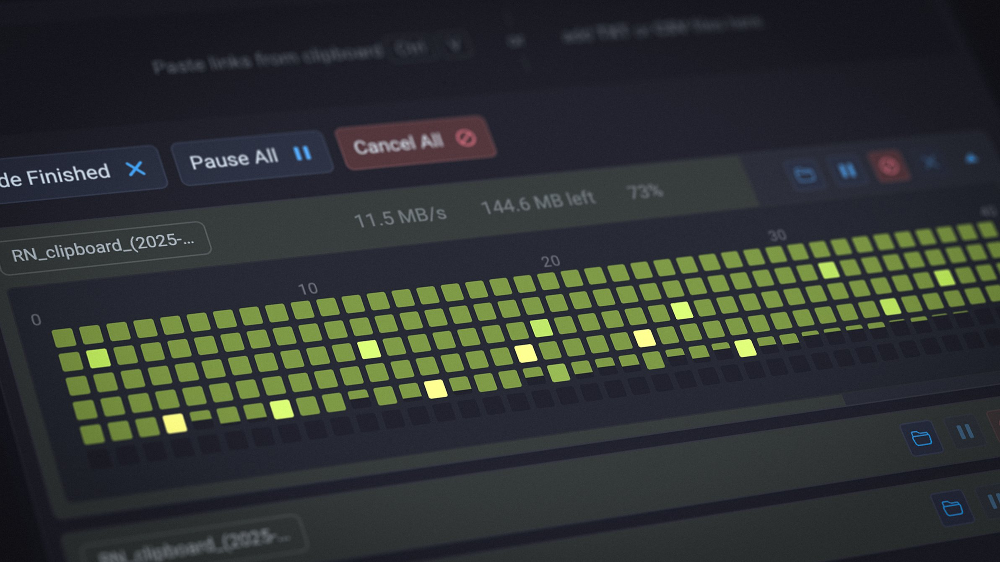

# Render Network Manager

The Render Network Manager is a desktop app that helps 3D artists work with the Render Network from their own computer. It brings together tools you need to upload scenes, create and manage render jobs, estimate costs, and download finished frames — all in one place.

You can use the app without signing in to quickly download rendered frames via the [Instant Download Manager](docs/instant_download_help.md). Once you sign in, you get full access to your scenes and jobs on the Network, along with tools like the [Render Cost Calculator](docs/calculator.md), render presets, [Differential Upload](docs/settings_differential_upload.md), and customizable download and upload [settings](docs/settings.md).

It works with ORBX (Octane Standalone), Cinema 4D, and Blender scenes, and you can tweak the app's behavior and layout to fit your workflow.

- [Help & Documentation](docs/index.md)
- [Download](https://github.com/nordskill/render-network-manager-app/releases/latest/)

