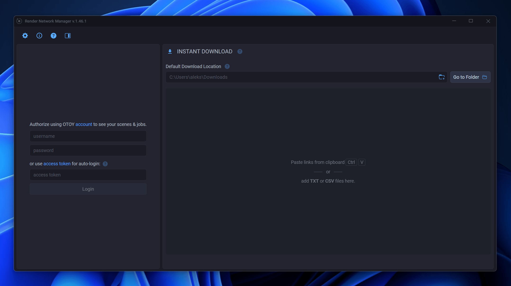

# Login and Authentication

The login screen is your starting point for accessing all the features of the Render Network Manager. To see the login form, click the "Toggle Compact Mode" button. You can sign in with your Render Network credentials or use a personal [access token](settings_access_token.md) for faster, more reliable repeat logins.

Once signed in, the app unlocks scene management, job creation, presets, and everything else you need to manage your renders.

But even without logging in you still can use the app as a download manager.

