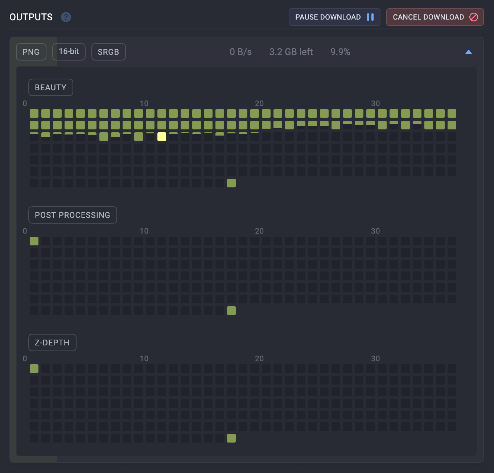

# Download First and Last Frames First

This setting makes the app prioritize the first and last frames of a sequence before continuing with the rest of the download.

## When to use it

Keep this enabled when you want editing, compositing, or review software to recognize the full frame range as early as possible. It is especially useful for long sequences imported into tools that infer clip length from boundary frames.

## Good to know

The setting only changes download order. It does not skip frames or change the final downloaded output.

